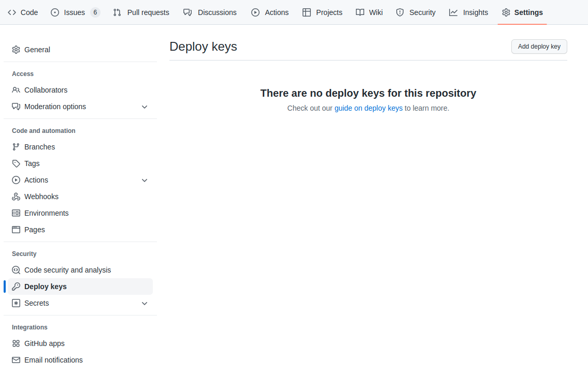

# Administration

The MLOps - Craft AI Platform is composed of a graphical interface
allowing you to visualize, create, manage and monitor the objects
necessary for the realization of your AI projects.

It is composed of:

- **Homepage**: Visualize and create projects.
- **Parameters**: Manage the company’s account and users.
- **Project settings**: Manage the configuration of a project.
- **Environments**: See the environment(s) and their information within
  a project.
- **Executions**: See the execution(s) and their information within an
  environment or a deployment.


> **Note**: We strongly recommend **Google Chrome browser** to use the
> graphical interface of the platform.

**Summary:**

- `Users <users>`
- `Projects <projects>`
- `Token SDK <tokensdk>`

(users)=

## Users

**Summary:**

- `Manage user <manage-user>`
- `Login <login>`
- `Get user with ID <user-id>`

(manage-user)=

### Manage user

The management of user is available by email for the moment. In a next
version, it will be possible to add, edit and delete a user directly on
the platform UI.

(add-user)=

#### Add a user

Send a message to Craft AI with your request and the following
information:

- First and last name of the user
- Email of the user

```{raw} html
<div style="background-color:#f3f6f6; padding: 12px;">

   🆕 Adding users will arrive later on the platform.

</div>
```

#### Access rights

Each user has access to one or more defined projects.

Each user who has access to a project has access to all the information and actions in it.

```{raw} html
<div style="background-color:#f3f6f6; padding: 12px;">

   🆕 Advanced access rights will arrive later on the platform.

</div>
```

#### Delete a user

Send a message to Craft AI with your request and the following
information:

- First and last name of the user
- Email of the user

```{raw} html
<div style="background-color:#f3f6f6; padding: 12px;">

   🆕 The deletion of users will arrive later on the platform.

</div>
```

(login)=

### Login

Here is the URL to access the platform: https://mlops-platform.craft.ai

#### First connection

**Prerequisites**: The user must be added to the platform (`Add a user <add-user>`).

1. The user connects to the platform: https://mlops-platform.craft.ai
   The connection will not work, but Craft AI will receive the request
   and can add the user.
2. The user receives an email/slack from Craft AI to inform him that he
   can log in.
3. The user logs in with the same link and has access to the platform.

#### Forgot your password

1. In the Login popup, click on *Don’t remember your password?*
2. Enter your email, you will receive an email to modify your password.


(user-id)=

### Get user with ID

#### Function definition

While using the SDK you may encounter outputs parameters containing a user when using specific functions. Each user is identified with a unique ID. That is the case for example in the `sdk.get_pipeline_execution()` function output with the parameter `created_by`. To match the user ID with the corresponding information (name and email) you can use the `get_user()` function. 


```python
CraftAiSdk.get_user(user_id)
```

#### Parameters

- `user_id` (str) – The ID of the user.

#### Returns

The user information in dict type, with the following keys:
- `id` (str): ID of the user.
- `name` (str): Name of the user.
- `email` (str): Email of the user.

(projects)=

## Projects

A **project** is a complete use case. From data import, through
experimentation, testing and production, to performance monitoring over
time.

Users can create as many **projects** as they want. Each project is
hermetically sealed from the others. All users on the platform can
access to all projects.

To work on a project, it must include at least one **environment**. The
user can create several environments in a project.

**Summary:**

- `Create a project <create-project>`
- `Manange a prject <manage-project>`

(create-project)=

### Create a project

1. From the homepage, you can create a new project by clicking on the
   “New project” button.

2. A project creation page opens in which you have to fill in the fields
   \:

   1. **\[Mandatory\]**`Project name` : Enter the name of your project (in
      lowercase and with “-”), you will not be able to modify it later.

   2. **\[Mandatory\]**`Python version` : Select the version of Python
      that will be applied to this project. It will be possible to
      choose a different version when creating each step.

   3. **\[Mandatory\]**`Repository URL` : Enter the SSH URL of your repository.

      - How to get my repository URL

        On GitHub, from your repository, click on the “Code” button and
        choose SSH. The URL must start with “git@”.

        ```{image} ./screen/administration_1.png
        :alt: project creation screen
        ```

        On GitLab, from your repository, click on the "Clone" button and
        copy SSH URL. The URL must start with “git@”.

   4. **\[Mandatory\]**`Deploy key` : Enter your Github / GitLab private key.

      How to generate my deploy key :

      ```{container} toggle, toggle-hidden
      For security reasons, to get access to your GitHub project, the
      platform uses a Deploy Key with the RSA SSH KEY standard. The
      deploy key is a special key that grants access to a specific
      repository; it is not the same as personal keys used commonly
      by users to access their repositories, although they are both
      SSH keys.

      The deploy key has two elements:

      - The public key, which must be set in the GitHub
        administration settings for the repository.
      - The private key, which must be sent to the Craft AI MLOps
        Platform, so it can access the repository.

      Please follow these steps:

      1. You will need to generate an SSH key on your computer.

         - On Linux and macOS

           ```{container} toggle, toggle-hidden
           Move to a new directory and run the following command, by
           replacing `*your-key-filename*` by a name of
           your choosing.
           `ssh-keygen -m PEM -t rsa -b 4096 -f *your-key-filename* -q -N "" -C ""`
           This will generate two files: a file named
           `*your-key-filename*` with the “private key” used
           for creating a step, and a file named
           `*your-key-filename*.pub` with the “public key”
           used to create the Deploy Key on GitHub. These files
           should not be included in the step’s directory. Only the
           type of SSH key generated by this command is accepted
           when creating the Step.

           **Example on Linux / macOS :**

            ```python
            ssh-keygen -m PEM -t rsa -b 4096 -f *keyAccesPlatformCraftAI* -q -N "" -C ""
            ```
           

         - On window

           ```{container} toggle, toggle-hidden
           - Check that OpenSSH is installed and install it if it
             is not the case. (Go in Settings > Apps & features >
             Optional feature to get list of features and click on
             `add feature` to find and install OpenSSH)

           - Press the **Windows key**.

           - Type **cmd**.

           - Under *Best Match*, right-click **Command Prompt**.

           - Click **Run as Administrator**.

           - If prompted, click **Yes** in
             the *\`\`Do you want to allow this app to make changes to your device?\`\`*
             pop-up.

           - In the command prompt, type the following : ssh-keygen

           - By default, the system will save the keys to **C:Usersyour_username/.ssh/id_rsa**. You
             can use the default name, or you can choose more
             descriptive names. This can help distinguish between
             keys, if you are using multiple key pairs. To stick to
             the default option, press  **Enter**.

           - You’ll be asked to **enter a
             passphrase.** Hit **Enter** to skip this step.

           - The system will generate the key pair, and display
             the **key fingerprint** and a **randomart image**.

           - Open your file browser.

           - Navigate
             to **C:Usersyour_username/.ssh**.

           - You should see two files. The identification is saved
             in the **id_rsa** file and the public key is
             labeled **id_rsa.pub**. This is your SSH key pair.
           ```

      For GitHub :

      2. Head to the homepage of your repository on GitHub.

      3. Go to the Settings page.

      4. Once there, select the tab on the left named `Deploy Keys`

      5. Select `Add deploy key` on the Deploy Keys page.

         


      6. Insert the name you want for your deploy key

      7. Copy/paste the public key (content of
         `*your-key-filename*.pub`) in the second text box.

      8. Click on “Add key” (you don’t need to **allow write
         access**)

      For GitLab :

      2. Head to the homepage of your repository on GitLab.
      3. Click on `Settings` (left bar) then go to `Repository`
      4. Click on `Expand` in the `Deploy keys` section
      5. Insert the name you want for your deploy key.
      6. Copy/paste the public key (content of
         `*your-key-filename*.pub`) in the second text box.
      7. Click on `Add key` (you don’t need to **Grant write permissions to this key**)
      ```

   5. `Default branch` : Enter the Git branch you want as default
      for this project. If this field is empty, we will use the default
      Git branch. It will be possible to choose a different default
      branch within an environment.

   6. **\[Mandatory\]**`Folders` : Enter file(s) or folder(s) that will be
      accessible by the platform. By default, type `/` to have access
      to all the repositories. It will be possible to choose different
      files or folders within an environment.

   7. `Requirements.txt` : Enter the path to the requirements.txt file
      with the list of library to install automatically on this project.
      It will be possible to add a different file within an environment.

   8. `System dependencies` : Enter the list of the APT and/or APK
      packages that you want to install automatically on this project
      (for Ubuntu distribution). It will be possible to add different
      packages within an environment.

3. Click on “Create project”, you will see the project card displayed,
   and you can enter in it to create a first environment.

There are no access rights at first, all users of the platform have
access to all projects.

```{image} ./screen/administration_3.png
:alt: project edition
```


> **Note**: You will be able to modify these elements (except the
> project name) in the Settings section of your project.

**Next step**: [Create an environment](../environment/createEnvironment) in this project.

(manage-project)=

### Manage a project

#### Edit a project

Within your project, click on Settings to view and edit your project
information.

```{image} ./screen/administration_4.png
:alt: menu
```

On this page, you will find the information you set up when you created
the project.

You can change them, except the name of the project.

```{warning}
Don’t forget to save and validate the confirmation slider
to make the changes effective.
```

The changes will apply to steps created after this modification. These
changes may affect your steps and can make them non-functional.

```{image} ./screen/administration_5.png
:alt: key
```

#### Users in a project

Initially, all users of the platform have access to all projects without
special access rights.

```{raw} html
<div style="background-color:#f3f6f6; padding: 12px;">

   🆕 The access rights per user within a project will arrive later on the
   platform.

</div>
```

#### Delete a project

Initially, you cannot delete a project.

Submit an email request to delete a project from the platform.

```{raw} html
<div style="background-color:#f3f6f6; padding: 12px;">

   🆕 The deletion of a project will arrive later on the platform.

</div>
```

(tokensdk)=

## Access the SDK

The Craft AI MLOps Platform is composed of a Python SDK allowing you
to use, from your IDE, the functions developed by Craft AI to create
your steps, pipelines and deployments.

**Summary:**

- `Get token access <token-access>`
- `Connect to the SDK <connect-sdk>`

(token-access)=

### Get token access

In the header, click on your name and go to the “Parameters” page.

```{image} ./screen/administration_6.png
:alt: menu
```

At the bottom of the “Account” page, you will find your SDK token,
which will allow you to identify yourself to use the SDK.

You can **regenerate** it, the old token will be obsolete, and you will
have to identify yourself again to the SDK to access it.

```{warning}
The SDK token is strictly personal. You must keep it to yourself.
```

```{image} ./screen/administration_7.png
:alt: key
```

(connect-sdk)=

### Connect to the SDK

You must **install** the SDK from a Python terminal, with the command :

```bash
pip install craft-ai-sdk
```

Run the following commands in a Python terminal to **initialize** the
SDK.

1. Enter the `CRAFT_AI_ENVIRONMENT_URL`, you can find on Get
   environment URL.

   It should look like `https://brisk-hawk-charcoal-zeta-42.mlops-platform.craft.ai`.

   If you don’t have any environments in your project yet, you should
   [Create an environment](./../environment/createEnvironment).

2. Enter your personal `CRAFT_AI_SDK_TOKEN`, you can find it in "Parameters" on the platform web UI.

   ```bash
   export CRAFT_AI_ENVIRONMENT_URL="*your-env-URL*"
   export CRAFT_AI_SDK_TOKEN="*your-token-acces*"
   ```

3. Execute the following Python code to set up SDK Python object.

   The SDK will automatically take into account your environment variables for the installation of the connection to the platform.

   ```python
   import os
   from craft_ai_sdk import CraftAiSdk

   sdk = CraftAiSdk()
   ```

   You can also specify it directly in the constructor, although this method is not recommended.

   ```python
   import os
   from craft_ai_sdk import CraftAiSdk

   sdk = CraftAiSdk(
       environment_url="*your-env-URL*",
       sdk_token="*your-token-acces*"
   )
   ```
