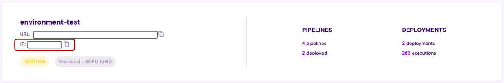

# Accessing your data

When executing your code within Pipelines on the Craft AI Platform, one crucial aspect is the ability to retrieve and store data. In this context, we will explore two approaches to acquiring data during our Pipeline Executions: 

- Using the **Data Store** provided by the Craft AI Platform, which offers a convenient way to store and retrieve objects on the environment.
- Connecting to **external data sources** like you are used to. By accessing your own organization database, cloud external database, some open source data, data available via FTP or some data storage such as the classic ones offered by AWS, Azure, or Google Cloud Platform, we can expand the range of data available for our Pipeline Executions.

By combining the capabilities of both the Data Store and external data sources, we can ensure a reliable and efficient data retrieval system for our executions. We will take a closer look at the techniques and practices of retrieving data for pipeline executions. 

:::warning
    Be aware that when an execution is launched on the platform, what is on its execution context is **not persistent (i.e. it does not remain after the execution)**, all data kept in memory or on the disk is removed at the end of the execution. It is possible to read, write and manipulate data during the execution, but everything in the execution context at the end of the execution is deleted. 

    This allows you to have an **identical and stable execution context** for each run, while avoiding needlessly saturating the disk with your executions.

    To ensure the **persistence of your data**, you can use data sources: It can be the Data Store, your own database or external data storage.

:::

## Summary 


1. [How to store data on the Data Store](#how-to-store-data-on-the-data-store) 
2. [How to retrieve data from the Data Store](#how-to-retrieve-data-from-the-data-store)
2. [How to access an external Data Source](#how-to-access-an-external-data-source)


## How to store data on the Data Store

Here we will see how to store files created within a step.

To do this, we will see 2 methods:

1. With the dedicated SDK function `upload_data_store_object()`

    **Advantages:** 
    - More **flexibility** at the Data Store path level. This method allows you to upload files to any location on the Data Store, as you can easily change the file path by providing a different input to the code.
    
    **Drawbacks:** 
    
    - Need to initialize the SDK in the step.
    - No tracking (the file path values given as inputs are not stored).

2. With an Output mapping to the Data Store

    **Advantages:** 
    - No need to initialize the SDK on the step.
    - tracking of the file used in this execution.
    
    **Drawbacks:** 
    
    - Need to define the Storage location on the Data`upload_data_store_object()` Store before creating the deployment and the path can’t be modified afterwards.
    - Only one possible storage location.

### With the dedicated SDK function `upload_data_store_object()`

You can also access the Data Store directly from the step code by using the SDK function `upload_data_store_object()`. 

:::warning
    Note that you need to import the craft_ai_sdk library at the beginning of the code, and have it in your requirements.txt.
:::

The SDK connection is initialized without token or environment URL, since the step will already be executed in the environment.

**Example**

        
``` py title="get_data.py" 
from craft_ai_sdk import CraftAiSdk

def preprocess_data():

    # SDK initialization
    sdk = CraftAiSdk()

    # Using an existing function get_data() to get raw data
    df_data = get_data()
    # Using an existing function preprocess_data() to preprocess
    # the previously retrieved data
    df_preprocessed_data = preprocess_data(df_data)
    # The existing function create_csv()  writes the dataframe 
    # df_preprocessed_data as a csv in path_to_preprocessed_data
    create_csv(df_preprocessed_data, path_to_preprocessed_data)
    
    # Upload into datastore with the SDK function upload_data_store_object()
    sdk.upload_data_store_object(
        filepath_or_buffer=path_to_preprocessed_data, 
        object_path_in_datastore="data/preprocessed/data_preprocessed.txt"
    )
```

Then, simply create the step and the pipeline to execute this code.


#### With an Output mapping to the Data Store

Here we will see how to store files that were created within a step to the data store. 

To do so, we have a few points to follow:

- **Adapt the code** that will be executed in the step, especially by specifying the path on which the file is accessible on the step.

``` py
def yourFunction() :
    ...
    return {"outputfile" : 
        {"path": **path of the file on the step**}
    }
```

- Before creating the step, **define the output** of the step with a data_type as `file`, and create the step and the pipeline as we are used to.

``` py linenums="1" hl_lines="5"
from craft_ai_sdk.io import Output

step_output = Output(
    name=step_output_name,
    data_type="file", 
)

sdk.create_step(
    function_path=**the path to your function**,
    function_name="your_function", 
    step_name=**your step name**,
    outputs=[step_output]
)

sdk.create_pipeline(pipeline_name=**your pipeline name**, 
	step_name=**your step name**)
```

- **Define the output mapping** (with the sdk object OutputDestination) that will be used for the execution of your pipeline, in this case, a `datastore_path` is needed to map the output of the step to a specific path on the Data Store.

``` py linenums="1" hl_lines="5"
from craft_ai_sdk.io import OutputDestination

output_mapping = OutputDestination(
	step_output_name=step_output_name,
	datastore_path=**path on which we want to store the file**,
)

sdk.run_pipeline(
	pipeline_name=**your pipeline name**,
	outputs_mapping=[output_mapping]
)
```

**Example**

In this part, we will create a deployment with an endpoint execution rule that returns 2 files, 1 file with text in .txt format and another with a fake confusion matrix in format .csv. 

First, we write the code to create the 2 files.To be able to pass the files to the Data Store, we specify the paths of the 2 files on the step.

:::info

    Note the step execution context is an isolated container, and it's the platform that will then copy the files from the execution context to the Data Store (thanks to the output we’ve created).
:::

Don’t forget to indicate the dependencies into requirements.txt.

``` py
import numpy as np
import pandas as pd

def createFiles() :

    # Define file into local step contenaire 
    path_text = "file_text_output.txt"
    path_matrix = "confusion_matrix.csv"

    # Create a fake confusion matrix into .csv file
    confusion_matrix = np.array([[100, 20, 5],
                                [30, 150, 10],
                                [10, 5, 200]])
    class_labels = ['Class A', 'Class B', 'Class C'] # Define the class labels
    df = pd.DataFrame(confusion_matrix, index=class_labels, columns=class_labels) # Create a DataFrame from the confusion matrix
    df.to_csv(path_matrix, index=True, header=True) # Save the DataFrame as a CSV file

    # Create .txt file
    text_file = open(path_text, 'wb')  # Open the file in binary mode
    text_file.write("Result of step send in file output :) ".encode('utf-8'))  # Encode the string to bytes
    text_file.close()

    # Return the path of the file in the container of the current step execution.
    fileOjb = {
        "txtFile" : {"path": path_text}, 
        "csvFile" : {"path": path_matrix}
    }
    return fileOjb
```

:::warning
    Remember to push step code to a GitHub repository defined in information project into Craft AI platform.
:::


After the initialization of SDK connection, we can create the 2 outputs and then the step. 

For this step, we assume that all the information is already specified in the project settings (language and repository information).

``` py
# Output creation
step_output_txt = Output(
    name="txtFile",
    data_type="file", 
)

step_output_csv = Output(
    name="csvFile",
    data_type="file", 
)

# Step creation with output (we supose repository is setup in info project)
sdk.create_step(
    function_path="src/createFiles.py",
    function_name="createFiles", 
    step_name="doc-2o-datastore-step",
    outputs=[step_output_txt, step_output_csv]
)
```

Now, we can create the pipeline. 

``` py
sdk.create_pipeline(pipeline_name="doc-2o-datastore-pipeline", 
    step_name="doc-2o-datastore-step")
```

To create an accessible endpoint, we need to create a deployment with two output mappings to the Data Store we created earlier.

Let’s pretend we want to store the files at `"docExample/resultText.txt”` and `"docExample/resultMatrix.csv"` on the Data Store.

``` py
endpoint_output_txt = OutputDestination(
    step_output_name="txtFile",
    datastore_path="docExample/resultText.txt",
)

endpoint_output_csv = OutputDestination(
    step_output_name="csvFile",
    datastore_path="docExample/resultMatrix.csv",
)

endpoint = sdk.create_deployment(
    execution_rule="endpoint",
    pipeline_name="doc-2o-datastore-pipeline",
    deployment_name="doc-2o-datastore-dep",
    outputs_mapping=[output_mapping_txt, output_mapping_csv]
)
```

After that, we can trigger the endpoint with the Python code below (we can use any other tool like postman, curl …).

``` py
import requests 

endpoint_url = **your-url-env**+"/endpoints/doc-2o-datastore-dep"
headers = {"Authorization": "EndpointToken "+endpoint["endpoint_token"]}

response = requests.post(endpoint_url, headers=headers)

print (response.status_code, response.json())
```


## How to retrieve data from the Data Store

Here, we will see how to retrieve files already stored on the Data Store within a step. 

To do this, we will see 2 methods:

1. With the dedicated SDK function `download_data_store_object()`

    **Advantages:** 
    - More **flexibility** at the Data Store path level. This method allows you to download files from any location on the Data Store, as you can easily change the file path by providing a different input to the code.
    
    **Drawbacks:** 
    
    - Need to initialize the SDK in the step.
    - No tracking (the file path values given as inputs are not stored).
2. With an Input mapping to the Data Store

    **Advantages:** 
    - No need to initialize the SDK on the step.
    - tracking of the file used in this execution.
    
    **Drawbacks:** 
    
    - Need to define the Storage location on the Data Store before creating the deployment and the path can’t be modified afterwards.
    - Only one possible storage location.

### With the dedicated SDK function `download_data_store_object()`

You can access the Data Store directly from the step code by using the SDK function `download_data_store_object()`. 

:::info

    Note that you need to import the craft_ai_sdk library at the beginning of the code, and have it in your requirements.txt.
:::


The connection is initialized without token or environment URL, since the Step will already be executed in the environment.

**Example**

    
``` py
from craft_ai_sdk import CraftAiSdk

def retrievePredictions(id_prediction: int):

    # SDK initialization
    sdk = CraftAiSdk()  

    # Download the file containing the predictions 
    # of the id_prediction at the local path "predictions.txt"
    sdk.download_data_store_object(
        object_path_in_datastore=f"data/predictions_{id_prediction}.csv", 
        filepath_or_buffer="predictions.txt"
    )

        # Open and print the content of the file now stored locally
    with open("predictions.txt") as f:
        contents = f.readlines()
        print (contents)
```

Then, simply create the step and the pipeline to execute this code.


### With an Input mapping to the Data Store

We will need to define the Input as a file for the step, the input mapping that connects the Data Store to the step and therefore the code embedded within the step to correctly read the file. Let’s start with the latter.

To do so, we have a few points to follow:

- **Adapt the code** to access and read your file. Indeed, the input that will be passed to the step will have a predefined form as a dictionary with path as key and the file path as a value. You thus need to access it the same way you retrieve the value of a dictionary.
The file will be downloaded in the execution environment before the step is executed. You can then use the file as you would use any other file in the execution environment.

    
    Here, we have a function `readFile` that aims to read the input file and print its content. 
    
    ``` py
    def read_file (entryFile: dict) :
    
        # Access the file with its local path (entryFile["path"]) on the step
        with open(entryFile["path"]) as f:
            contents = f.readlines()
            print (contents)
    ```
    
    :::warning
        One the code is updated, remember to push step code to a GitHub repository defined in information project into Craft AI platform.
    :::
    

- Before creating the step, **define the input** of the step with a `data_type` as `file`, and create the step and pipeline as we are used to.
    
    :::info
    
        We assume that all the information is already specified in the project settings (language, repository and branch information).
    :::

    
    
    ``` py
    from craft_ai_sdk.io import Input
    
    # Define the input of the step 
    step_input = Input(
        name="entryFile",
        data_type="file",    
    )
    
    # Create the step 
    sdk.create_step(
        function_path="src/read_file.py",
        function_name="read_file", 
        step_name="file-datastore-step",
        inputs=[step_input]
    )
    
    # Create the pipeline
    sdk.create_pipeline(pipeline_name="file-datastore-pipeline", 
        step_name="file-datastore-step")
    ```
    
    Once the pipeline is created, we define the correct input mapping and run the pipeline with it.
    
- **Define the input mapping** (with the SDK object InputSource) that will be used for the execution of your pipeline, in this case, a `datastore_path` is needed to map the input of the step to the file on the Data Store.
    
    Let’s pretend the file we want to retrieve is stored at `myFolder/text.txt` on the Data Store.
    
    ``` py
    from craft_ai_sdk.io import InputSource
    
    input_mapping = InputSource(
        step_input_name="entryFile"
        datastore_path="myFolder/text.txt", # Path of the output file in the datastore
    )
    
    # Run pipeline using mapping defined with InputSource object
    sdk.run_pipeline(
    	pipeline_name="file-datastore-pipeline", 
    	inputs_mapping=[input_mapping]
    )
    ```
    
    You can check the logs for your file content. 
    
    ``` py
    pipeline_executions = sdk.list_pipeline_executions(
        pipeline_name="file-datastore-pipeline"
    )
    
    logs = sdk.get_pipeline_execution_logs(
        pipeline_name=pipeline_name, 
        execution_id=pipeline_executions[0]['execution_id']
    )
    
    print('\n'.join(log["message"] for log in logs))
    ```
    

## How to access an external Data Source

The connection with an external data source (database or data storage) involves the following steps:

- **Using the same code you would use without the Craft AI platform to access your data storage.** You only have to encapsulate your code within a step and a pipeline, like any code you would like to execute on the Craft AI platform. You also may have to adapt the inputs and outputs of your main function to respect the Craft AI formats.


- **Embedding your credentials on your platform environment** to use them in your step code to access the database.

    🌟 To securely use credentials, a common good practice is to define **environment variables** to store the credentials safely. If you want to do so, the SDK offers you an easy solution: the `create_or_update_environment_variable()` function.
    
    ``` py
    sdk.create_or_update_environment_variable("USERNAME", "username_db_1")
    ```
    
    Then, when you need the credentials, you access it with the following command : 
    
    ``` py
    import os
    import dotenv
    
    dotenv.load_dotenv()
    
    username = os.environ["USERNAME"]
    ```
    


### From an external Database

**Moreover**, if you try to access to an external Database, we may have to **whitelist the IP of your Craft AI platform environment(s)** if necessary in your data source configuration. The environments IP are available on the page dedicated to your project environments. 



Here is an example of the few points to do in order to access a specific external database directly from our Craft AI environment platform by using the usual credentials and be able to filter on some data on the database:

:::tip

    If needed, add the Craft AI environment platform URL to the whitelist of the external database you want to access.
:::

- **First**, we embed the credentials we usually use to access to the database in our environment by setting them as environment variables.

``` py
sdk.create_or_update_environment_variable(
    environment_variable_name="DB_HOST",
    environment_variable_value="xxx")

sdk.create_or_update_environment_variable(
    environment_variable_name="DB_ADMIN",
    environment_variable_value="xxx")

sdk.create_or_update_environment_variable(
    environment_variable_name="DB_PASS",
    environment_variable_value="xxx")

sdk.create_or_update_environment_variable(
    environment_variable_name="DB_NAME",
    environment_variable_value="xxx")

sdk.create_or_update_environment_variable(
    environment_variable_name="DB_PORT",
    environment_variable_value="xxx")
```

- **Secondly**, we encapsulate the code we would use without the Craft AI platform in a function, here `filter_data_from_database()`, that will be executed within a step:
    - Below, we use an existing function `create_db_connection()` that creates a connection to the database with the credentials brought on our Craft AI environment platform.
    - Then, we use an existing function `filter_data()` that retrieves some data in a specific table on the database by filtering with the *ids* inputs on a specific column.
    - As input of our `filter_data_from_database()` function, we have this list of integer, *ids*, and as output we have a dictionary whose key is *filtered_data. ids* and *filtered_data* are respectively input and output of the step we would define after.
    
    Here is the corresponding code:
    
    ``` py
    import os
    import dotenv
    
    dotenv.load_dotenv()
    
    DB_HOST = os.environ["DB_HOST"]
    DB_ADMIN = os.environ["DB_ADMIN"]
    DB_PASS = os.environ["DB_PASS"]
    DB_NAME = os.environ["DB_NAME"]
    DB_PORT = os.environ["DB_PORT"]
    
    def filter_data_from_database(ids: List[int]) :
        try:
            # With an existing function create_db_connection,
            # Creating a connection to the database with the 
            # credentials brought on our Craft AI environment platform.
            conn = create_db_connection(
                host=DB_HOST,
                user=DB_ADMIN,
                password=DB_PASS,
                database=DB_NAME,
                port=DB_PORT
            )

            # With an existing function filter_data, 
            # Retrieving some data in a specific table on the database 
            # by filtering with the ids inputs on a specific column.
            df_data_filtered = filter_data(conn, ids)
            df_data_filtered_final = df_data_filtered.tolist()
        finally:
            conn.close()
        return {"filtered_data": df_data_filtered_final}
    ```
    

### From an external Data Storage

Here is an example of the few points to do in order to access a specific external data storage directly from a Craft AI environment platform by using the usual credentials and be able to retrieve one specific csv file:

- **First**, we embed the credentials we usually use to access to the data storage in our environment by setting them as environment variables.

``` py
sdk = CraftAiSdk(
    sdk_token=**our-sdk-token**, 
    environment_url=**our-environment-url**)

sdk.create_or_update_environment_variable(
    environment_variable_name="SERVER_PUBLIC_KEY",
    environment_variable_value="xxx")

sdk.create_or_update_environment_variable(
    environment_variable_name="SERVER_SECRET_KEY",
    environment_variable_value="xxx")

sdk.create_or_update_environment_variable(
    environment_variable_name="REGION_NAME",
    environment_variable_value="xxx")
```

- **Secondly**, we encapsulate the code we would use without the Craft AI platform in a function that will be executed within a step.
    - Below, we use an existing function `configure_client()` that configures a client (data storage specific) with the credentials brought on our Craft AI environment platform to access the data storage.
    - Then, we use an existing function `get_object_from_bucket()` **that, with the configured client, retrieves the object *key* in the bucket *bucket* on the data storage.

``` py
import os
import dotenv

dotenv.load_dotenv()

SERVER_PUBLIC_KEY = os.environ["SERVER_PUBLIC_KEY"]
SERVER_SECRET_KEY = os.environ["SERVER_SECRET_KEY"]
REGION_NAME = os.environ["REGION_NAME"]

def filter_data_from_data_storage(bucket: str, key:str)

    # With an existing function configure_client, 
    # Configuring a client (data storage specific) 
    # with the credentials brought on our Craft AI environment platform.
    client = configure_client(
        public_key=SERVER_PUBLIC_KEY, 
        secret_key=SERVER_SECRET_KEY, 
        region=REGION_NAME)

    # With an existing function get_object_from_bucket,
    # Retrieving the object key in the bucket bucket on the data storage.
    buffer = get_object_from_bucket(
        client=client,
        bucket_name=bucket,
        key=key
    )

    dataframe = pd.read_csv(buffer)
    return dataframe
```

<!-- 🤿 **To go further:**

If you are wondering how to, in general, implement the access to your data from a classic data storage (google storage, s3 or blob azure), you can follow our **guide**. -->